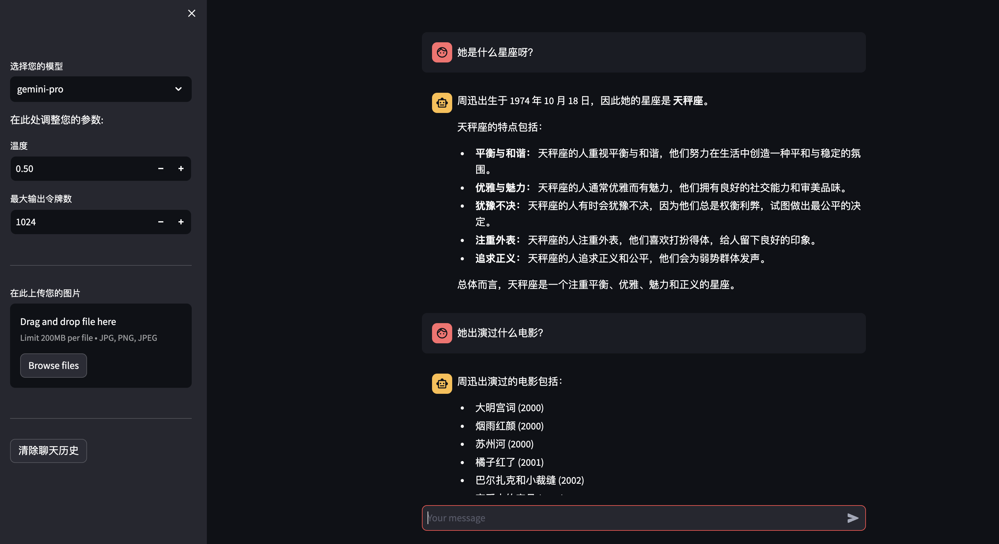

# comp5423 NLP chatbot with Gemini and self-model


### Introduction：

In this project, we implemented all the project task, including using a pre-trained model (Gemini) and training a model by ourselves, and in the self-trained model we introduced a knowledge graph, and finally tested it on test.txt and returned the results. Also we used Streamlit as a front-end component, and our code is on GitHub and can be accessed via this link.

### Environmental setup and preparation 

#### 1. To train the model:
Enter the dictionary of unimind-n
```
cd Model-train
cd unimind-n
```
Run the train.py, you can adjust the params to fit your device
```
python train.py --do_train --do_finetune --do_pipeline --beam_size=1 --warmup_steps=400 --max_seq_length=512 --max_target_length=100 --gpu=0 --overwrite_output_dir --per_gpu_train_batch_size=10 --per_gpu_eval_batch_size=10 --data_name=durecdial
```
Finally you can get the saved trained model in the model dictionary, which named model.pt

#### 2. How to run the dialog system

You can quickly install the package in requirement.txt through the command line code below.

```
pip install requirement.txt
```

If you want to use our model function please download the model by this [link](https://drive.google.com/file/d/1u7GahUbk5uoTRItzUbSp7q_YYKoEo3w_/view?usp=drive_link). And put the .pt file into ./model

### Start the chatbot command

Start the application in the CLI with the following code.

```bash
streamlit run run.py
```

Please note that due to regional policies, if vpn is not enabled it may cause errors when using the gemini model, so please enable vpn or start via GitHub codespace. When starting via codespace, please make sure to set the port to public.

### demonstration

In this part, we will show the effect of the project. After starting the project, you need to enter the google api key and then enter the project, as shown in the following figure:


Considering the trouble of applying for api, we contributed the api we applied for at the backend, so when you run it directly, you will come directly to the chatbot page, as shown in the figure below.


Through the left sidebar, you can select the model of the chatbot you want to use here. We provide gemini-pro, gemini-pro-version and our-model here (this will be expanded in detail in later chapters). For text chat, we can choose gemini-pro. Of course, you can also choose gemini-pro-version to open the conversation by uploading a picture, but note that the model only supports monothetical dialogue.

Below the model selection, you can set some gemini parameters, such as temperature and max token. Of course, you can also set more detailed parameters directly through the backend, such as:

```
model = genai.GenerativeModel('gemini-pro')
generation_config = genai.types.GenerationConfig(
	temperature=temperature,
	max_output_tokens=max_output_tokens,
	stop_sequences=preprocess_stop_sequences(stop_sequences=stop_sequences),
  top_k=top_k,
  top_p=top_p)
)
```

Below is `Clear History Information`. This button will immediately clean up the historical information of the current chatbot. As shown in the figure below, the picture on the left shows the question and answer through the model, and the picture on the right directly clears the historical information.

<center class="half">
    
</center>

